# PROJECT 6: WEB SOLUTION WITH WORDPRESS
## In this project I'm to prepare storage infrastructure on two Linux servers and implement a basic web solution using WordPress

`First i created 2 "Red heart" instances i named one "Web Server and the other "Database Server" `

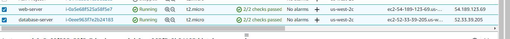

`Icreated 10gb 3 volumesand attched the volumes to my web-server instnace  `

`I connected to my web server instance and confirmed that the volumes were attached using the lsblk command `

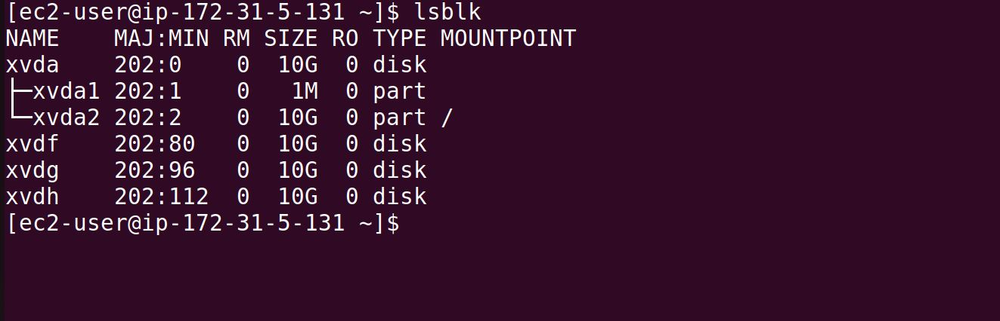

`I created partitions on the three disk using the gdisk command on the webserver instance `

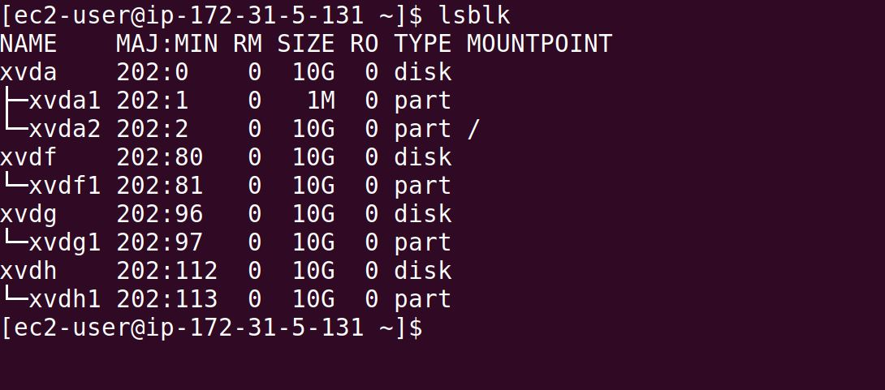

` i Installed Lvm2 using the Yum Manager `

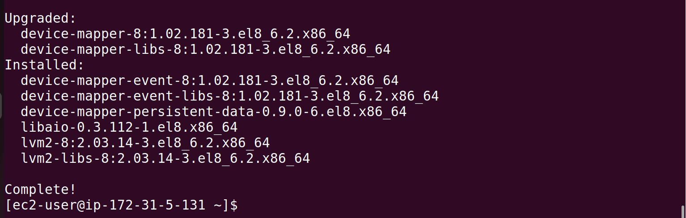

`I created physical volume on each Disk using the Pvcreate-Command `

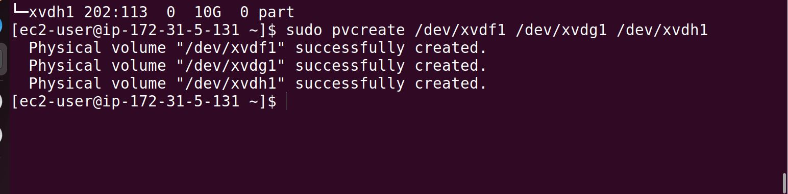

`I created volume group and but them in the group aftwer which i created two logical volumes with them  `

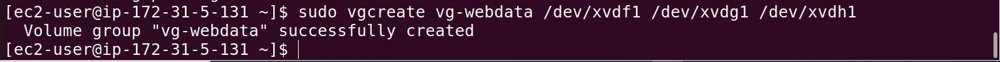

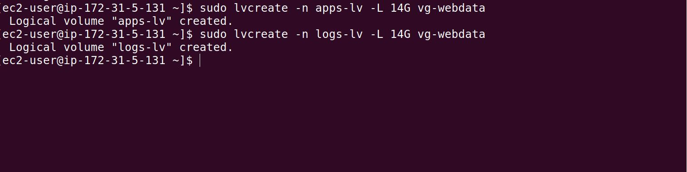

`I formatted both volumes `

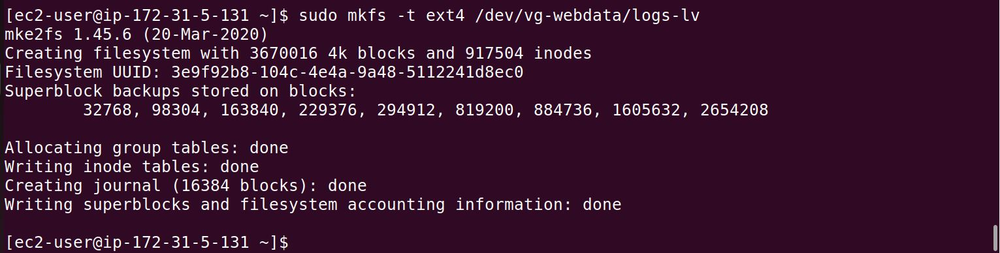

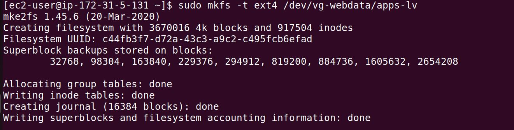

`I made two directory var/www/html and home/recovery/logs mounted one of the volumes i named app-lv on the var/wwww/html directory `

`I backed up the second direcrtory (home/recovery/logs) using the Rsync command afterwhich i mounted the second volume log-lv on the directory  `

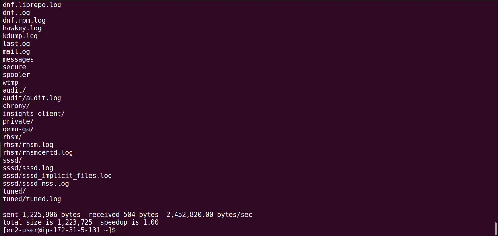

`I backed up the second direcrtory (home/recovery/logs) using the Rsync command afterwhich i mounted the second volume log-lv on the directory  `

`i edited Fstab to add the path for the files  `

`I initiated FStab update  `

`I went back to my AWS and created as well attached 3 volumes to my database instance`

`I connected to my instance and confirmed that the volumes were attached after which i partitioned them using the gdisk command  `

`I installed Lvm2 Using The Yum Manager  after which i created physical volumes on the partitions`

`I cretaed the volume group which i needed to do before i now created logical volume and formated using "ext4" `

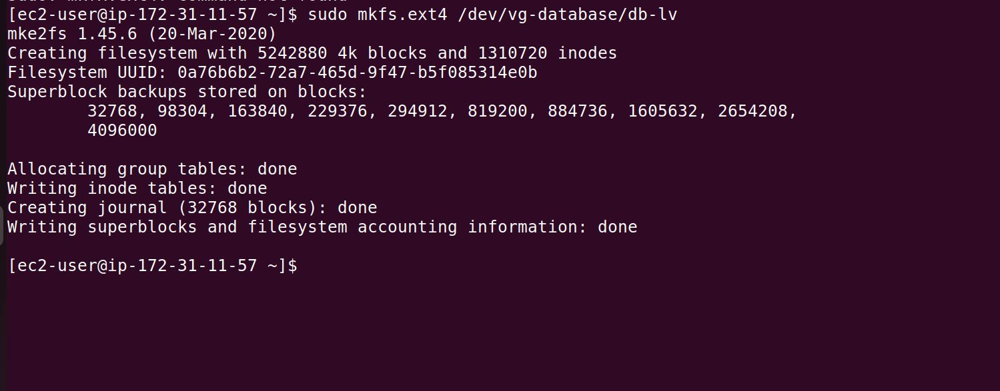

`I mounted it on a new directory i made and it worked as listed on my Documentation `

[Servers](./Images/29.%20.MountedAnd%20it%20workedAftercreatingDirectories%20as%20listed%20on%20my%20Documentation.JPG)

`i edited Fstab to add the path for the files and as well checked to confirm mount was succesful`

`I installed PHP and checked to confirm that my http was installed and running. I checked to be sure my apache was up on browser using ip address`

#Pls kindly note that i changed to a new instance and contionued my documentation from the last place i stopped on my previos instance... Thank you

`I created the wordpress directory and cd'ed into it and downloaded wordpress on the directory after which, i extracted wordpress and copied the contents in Config-sample to a new file "config" on my wordpress`

`I copied content of wordpress to html directory after which I  installed and enabled mysql on the webserver and did the same for data base server`

`I crated user,database and granted privileges on mysql`

`I edidted my cnf file to bind adress to red heart allowing traffic from anywhere`

`I edited the wp-config file and updtaed the database,user name and ip address and confirmed and both servers were communicating ell and connecting using ip address`

`I chnaged onwership of html to include apache `

` I set the paramaters to ensure it connects `

`Wordpress is installed and working perfectly `

